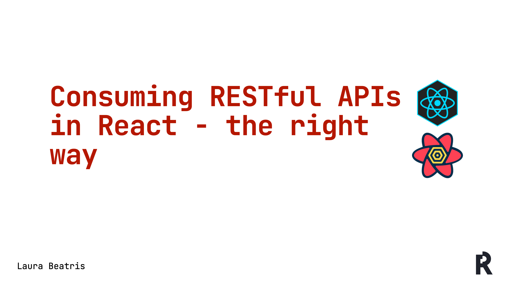

<p align='center'>
  
</p>

## Getting Started

Requirements: Node.js, Package Manager (yarn or NPM)

### Clone repository
```bash
# With HTTPS
https://github.com/LauraBeatris/react-query-workshop.git

# With SSH
git clone git@github.com:LauraBeatris/react-query-workshop.git

# With GitHub CLI
gh repo clone LauraBeatris/react-query-workshop
```

### Install dependencies

```bash
# With NPM
npm install

# With yarn
yarn install
```

### Start development server

```bash
# With NPM
npm dev

# With yarn
yarn dev
```
